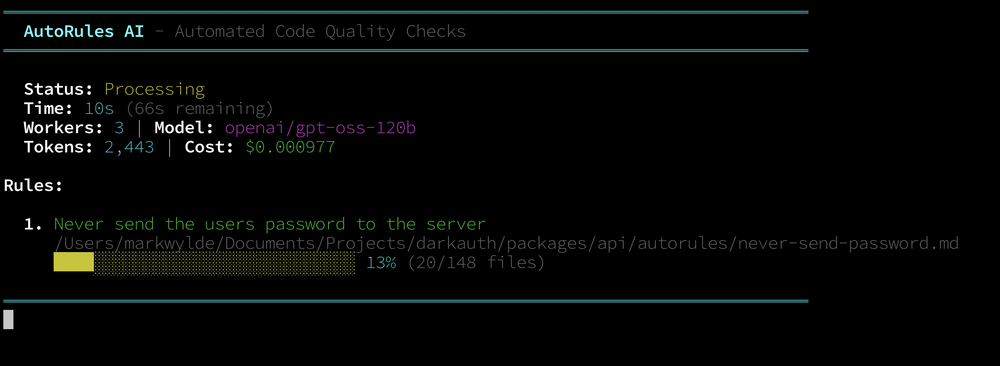
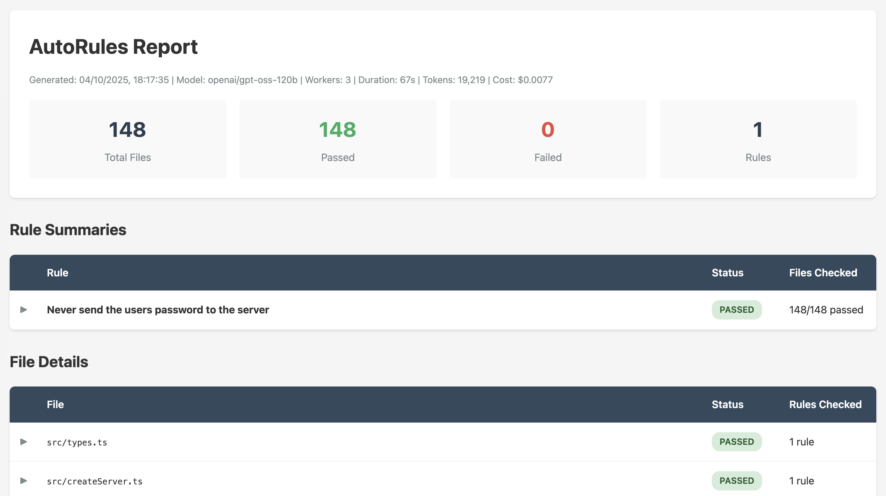

## The Problem with Building Zero-Knowledge Auth

I've been building [DarkAuth](https://github.com/puzed/darkauth), a zero-knowledge OAuth/OIDC server that uses OPAQUE (RFC 9380) to ensure users' passwords and derived encryption keys never reach the server. It's proper zero-knowledge - the server literally can't see the password, not even encrypted.

As you can imagine, this project has some pretty serious concerns:

**Security risks:**
1. Accidentally sending the user's password to the server
2. Accidentally sending the user's derived encryption key to the server
3. Introducing vulnerabilities in controllers or models

**Code quality:**

4. Not following the established code style patterns
5. Not making generic functions pure and abstractable

I could use Claude Code or Cursor to review the code, but they're slow and often miss files or folders. They'll tell me everything's fine when it isn't. I needed something systematic.

## So I built AutoRules

[AutoRules](https://github.com/markwylde/autorules) is an open source tool that asks AI a bunch of questions about every file in your project based on a pattern you define.

The basic idea: run an AI model against every file that matches a pattern, asking it specific questions. Get back a report showing passes, failures, and exactly which files have issues.

Here's what I run for DarkAuth:

```bash
autorules --workers=3 --model=openai/gpt-oss-120b --provider-sort=throughput
```

It checks 148 files in about 70 seconds for $0.0077. Not even a cent. And I'm getting around 300 tokens per second.



When it's done, you get a full HTML report:



**[📄 View Example Report (PDF)](/autorules-example-report.pdf)**

## How it works

AutoRules looks for `autorules` folders in your project. For DarkAuth, I have one at `/packages/api/autorules`.

Inside that folder, you create rule files as Markdown documents. Each rule is a separate `.md` file with a simple structure:

```markdown
title: Never send the users password to the server
files: src/**/*.ts
---

This file should not send the user's password to the server in any way.
Look for fetch calls, axios requests, or any HTTP methods that might
include password data in the request body or headers.
```

That's it. Title, glob pattern, separator, then natural language criteria.

The glob pattern targets which files to check:
- `src/**/*.ts` - all TypeScript files
- `packages/*/controllers/*.ts` - just controllers
- `**/*.{js,ts}` - both JS and TS files

Here's what happens when you run it:

**1. Scan**: Finds all `autorules` folders in your project

**2. Parse**: Loads the rule files and extracts the criteria

**3. Match**: Uses glob patterns to find files to check

**4. Analyze**: Sends each file to the AI with your rule criteria. The AI responds with PASS or FAIL plus specific reasoning.

**5. Report**: After all files are checked, the AI does one final analysis looking at all the results together. This catches patterns across files that individual checks might miss. Then it generates an interactive HTML report.

The report shows:
- Total files checked per rule
- Pass/fail counts
- Which specific files failed and why
- Token usage and cost
- Expandable details for each check

## Why it's fast

Speed comes from three things:

**1. Parallel workers**: Multiple files checked simultaneously. I use 3 workers which keeps things moving.

**2. Fast models**: I'm using `openai/gpt-oss-120b` on providers sorted by throughput. Cerebras and Groq are particularly good for this - they're optimized for speed.

**3. Simple task**: Each check is independent. No conversation history, no context building. Just a file and a question.

300 tokens per second means I can validate my entire codebase in the time it takes to make coffee.

## Notes

**AI is non-deterministic**: Run the same check twice and you might get different results. Sometimes there are false positives. Sometimes it flags things that aren't real issues. But that's still useful - these flags serve as pointers for deeper investigation. When AutoRules highlights something, I'll hand it off to Claude Code or Cursor for proper analysis. It's like having a first-pass filter that catches potential problems.

**False positives happen**: Especially with older or smaller models. But gpt-oss-120b has been excellent. It understands context and gives reliable answers most of the time. When it does flag something incorrectly, it's still worth knowing why the AI thought it was an issue.

**Specificity matters**: Vague questions get vague answers. "Does this file have security issues?" is too broad. "Does this file send the user's password to the server?" is specific and actionable.

**Cost is negligible**: Less than a cent to check 148 files. I can run this on every commit without worrying about cost.

**Reports are documentation**: The HTML report becomes a security audit trail. I can share it with contributors or reference it later.

## Future ideas

I'm thinking this could work really well in GitHub Actions. Imagine:
- Run AutoRules on every pull request
- Post results as a comment
- Block merges if critical rules fail

You could have rules like:
- "Does this file use deprecated functions?"
- "Are there any SQL injection vulnerabilities?"
- "Does this follow our error handling patterns?"
- "Are secrets properly handled?"

It's like having an AI code reviewer that actually checks every file systematically, not just the ones it happens to look at.

## When to use it

AutoRules is great for:
- Security-critical codebases where specific patterns must never appear
- Enforcing code style consistency across large projects
- Auditing third-party code or dependencies
- Pre-commit validation of specific rules
- Continuous monitoring of code quality

Not ideal for:
- Complex logic validation (AI can miss subtle bugs)
- Anything requiring deep understanding of business logic
- Real-time validation during development (it's fast but not instant)

## The implementation

It's built with Node.js and supports multiple AI providers through a unified interface. You can use OpenAI, Anthropic, Groq, Cerebras, or any OpenRouter-compatible provider.

The worker pool keeps things efficient. Results stream in as they complete rather than waiting for everything to finish.

Error handling is solid - if a file fails to check, it's reported but doesn't stop the whole run.

## What's next

I've only got one rule so far for DarkAuth, but I'm planning to add more:
- Check for encryption key leaks
- Validate controller authorization patterns
- Ensure database queries use parameterized statements
- Verify error messages don't leak sensitive info

The tool is flexible enough to handle all of these.

## Wrapping up

AutoRules does one thing well: systematically validate your codebase against specific rules using AI. It's fast, cheap, and reliable.

For security-critical projects like DarkAuth, having this kind of automated validation gives me confidence that I haven't accidentally introduced issues. It's not perfect - AI can make mistakes - but it's way better than manual review or hoping I don't miss something.

The source is on GitHub. Give it a try if you need systematic AI-powered code validation.

## 🚀 Try It Yourself

Ready to validate your codebase with AI?

<div style="text-align: center; margin: 2rem 0; padding: 1.5rem; background: #f8f9fa; border-radius: 8px; border: 1px solid #dee2e6;">
  <a href="https://github.com/markwylde/autorules" style="display: inline-flex; align-items: center; gap: 0.5rem; color: #24292f; font-weight: 600; text-decoration: none; font-size: 1.1rem;">
    <svg width="20" height="20" viewBox="0 0 24 24" fill="currentColor">
      <path d="M12 0c-6.626 0-12 5.373-12 12 0 5.302 3.438 9.8 8.207 11.387.599.111.793-.261.793-.577v-2.234c-3.338.726-4.033-1.416-4.033-1.416-.546-1.387-1.333-1.756-1.333-1.756-1.089-.745.083-.729.083-.729 1.205.084 1.839 1.237 1.839 1.237 1.07 1.834 2.807 1.304 3.492.997.107-.775.418-1.305.762-1.604-2.665-.305-5.467-1.334-5.467-5.931 0-1.311.469-2.381 1.236-3.221-.124-.303-.535-1.524.117-3.176 0 0 1.008-.322 3.301 1.23.957-.266 1.983-.399 3.003-.404 1.02.005 2.047.138 3.006.404 2.291-1.552 3.297-1.23 3.297-1.23.653 1.653.242 2.874.118 3.176.77.84 1.235 1.911 1.235 3.221 0 4.609-2.807 5.624-5.479 5.921.43.372.823 1.102.823 2.222v3.293c0 .319.192.694.801.576 4.765-1.589 8.199-6.086 8.199-11.386 0-6.627-5.373-12-12-12z"/>
    </svg>
    View on GitHub
  </a>
  <p style="margin-top: 1rem; color: #6c757d; font-size: 0.9rem;">
    Documentation, examples, and installation instructions
  </p>
</div>

<div style="text-align: center; margin: 2rem 0;">
  <a href="https://www.npmjs.com/package/autorules" style="display: inline-flex; align-items: center; gap: 0.5rem; color: #cb3837; font-weight: 600; text-decoration: none; font-size: 1.1rem;">
    <svg width="20" height="20" viewBox="0 0 780 250" fill="currentColor">
      <path d="M240 250h100v-50h100V0H240v250zM340 50h50v100h-50V50zM480 0v200h100V50h50v150h50V50h50v150h50V0H480zM0 200h100V50h50v150h50V0H0v200z"/>
    </svg>
    Install from npm
  </a>
  <p style="margin-top: 1rem; color: #6c757d; font-size: 0.9rem;">
    npm install -g autorules
  </p>
</div>
