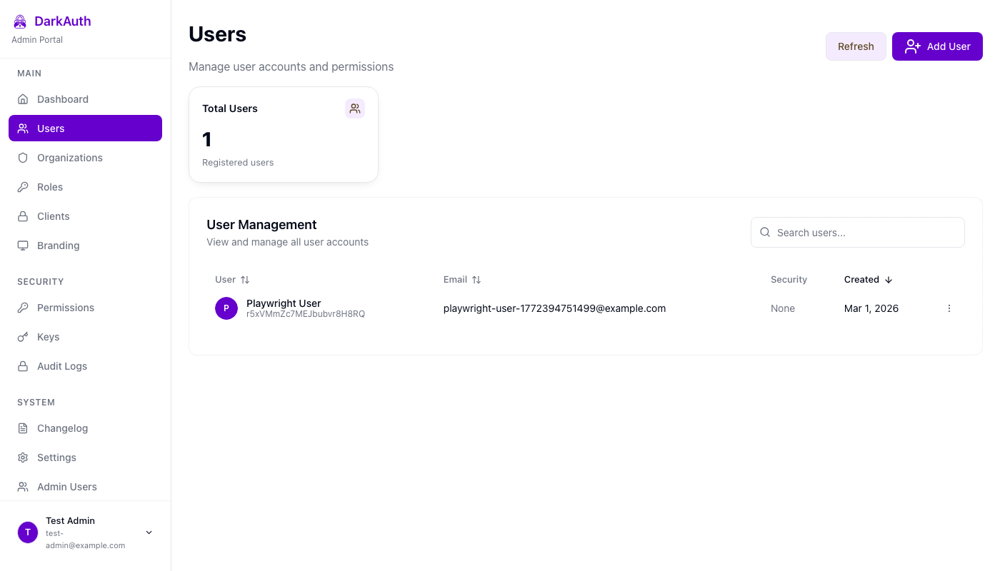

I've been quiet on the blog for a few weeks because I've been deep in the trenches with [DarkAuth](https://github.com/puzed/darkauth).

If you're new here, DarkAuth is my attempt at a zero-knowledge OAuth/OIDC server. It uses the OPAQUE protocol so the server never actually sees your password, and it can deliver encryption keys (DRKs) to clients without them ever hitting the backend.

The project is still very much in its early days, but the last two months have been about moving away from "it works on my machine" toward something I'd actually trust to run in production.

Between January 1 and March 2, that turned into 61 merged PRs, 228 commits, and 29 releases.

## The Shift to Server-Managed Sessions

In the early prototype days, I was obsessed with the idea that nothing sensitive should ever touch the server, not even in an encrypted form. I was building DarkAuth as a pure SPA where the client handled everything, storing tokens and secrets in `localStorage` just to keep them away from the server's reach.

But as the project evolved, I realized this created its own set of problems, mostly around security and the lack of a proper session lifecycle.

I've since simplified my stance: as long as the server can't read or decrypt the keys, it's okay for the server to hold onto the envelopes. By accepting that the server can store wrapped Data Root Keys (DRKs) that only the client can unwrap, I was able to move back to a much more robust and standard OIDC flow.

## The Cookie-Only Security Model

With that shift, I've completely ditched `localStorage` for session management. I was treating the auth flows like a pure SPA, but that model doesn't give me the security guarantees I actually want.

Now, DarkAuth enforces a strict cookie-only first-party session model. I've moved token and refresh handling to server-managed cookies with the safety flags you'd expect: `HttpOnly`, `Secure`, and `SameSite=Lax`.

I also split cookies by cohort:

- `__Host-DarkAuth-User`: user-facing OIDC flow
- `__Host-DarkAuth-Admin`: administrative dashboard

I added cohort-specific CSRF cookies and double-submit CSRF checks for state-changing requests. This was one of those changes that touches everything, but it was worth the pain.

## Hardening the ZK + OIDC Flow

The magic of DarkAuth is still the zero-knowledge delivery of Data Root Keys. Even though the server now stores wrapped DRKs, it still can't decrypt them without the `export_key` derived from the user's password (via OPAQUE).

To make this flow much harder to break, I tightened a few critical paths:

1. Strict `drk_hash` binding in authorize/finalize.
2. Nonce persistence and validation in the auth code flow.
3. Constant-time PKCE challenge comparison.
4. Atomic single-use auth code redemption.
5. Refresh token hardening (hashed lookup, single-use rotation, client binding, transport boundaries).

The goal was to remove as many edge-case footguns as possible from the auth pipeline.

## UI and Product Work

I did a lot of UI work in this window, across admin-ui and user-ui. But I didn't end up building a single unified component library that I really want.

What actually shipped:

- Better admin table/list UX and standardized list contracts.
- Improved row actions and error handling in admin flows.
- OTP auto-submit when a 6-digit code is complete.
- Better branding preview/theme behavior.
- Login/config loading fixes to remove flicker and false error flashes.
- Dashboard card settings and client icon support across admin + user surfaces.

So the UX got materially better, just not via a single unified component package.

*The Admin UI after table and RBAC workflow improvements.*

## RBAC Changes

RBAC evolved a lot.

I landed organization-scoped roles and permissions, standardized admin list endpoints, and then removed the legacy groups runtime/pages that were still hanging around.

So if you looked at an older snapshot of the project, the old groups model is no longer the right mental model now.

## Email Verification and Template Flows

A big late-February/early-March addition was email verification:

- verification tokens and SMTP integration in the API
- email templates and verification flows in admin-ui/user-ui
- auth gating so unverified users get routed correctly

## Running on Node 24

I've also moved the project to Node 24-compatible runtime patterns, including native TypeScript runtime support and Docker/runtime cleanup.

If you're running the Docker image (`ghcr.io/puzed/darkauth:latest`), you're on that newer runtime path.

## What's Next?

The goal for the rest of Q1 is to keep improving documentation and make first-run setup smoother. I've added a lot of power features recently, but I don't want to lose the simplicity that makes DarkAuth easy to self-host.

If you want to poke around the code or try running it yourself, it's all on GitHub. It's still early, but it's getting closer to where I want it to be.

## Try It Yourself

Ready to run your own zero-knowledge auth server?

  <a href="https://github.com/puzed/darkauth" style="display: inline-flex; align-items: center; gap: 0.5rem; color: #24292f; font-weight: 600; text-decoration: none; font-size: 1.1rem;">
    <svg width="20" height="20" viewBox="0 0 24 24" fill="currentColor">
      <path d="M12 0c-6.626 0-12 5.373-12 12 0 5.302 3.438 9.8 8.207 11.387.599.111.793-.261.793-.577v-2.234c-3.338.726-4.033-1.416-4.033-1.416-.546-1.387-1.333-1.756-1.333-1.756-1.089-.745.083-.729.083-.729 1.205.084 1.839 1.237 1.839 1.237 1.07 1.834 2.807 1.304 3.492.997.107-.775.418-1.305.762-1.604-2.665-.305-5.467-1.334-5.467-5.931 0-1.311.469-2.381 1.236-3.221-.124-.303-.535-1.524.117-3.176 0 0 1.008-.322 3.301 1.23.957-.266 1.983-.399 3.003-.404 1.02.005 2.047.138 3.006.404 2.291-1.552 3.297-1.23 3.297-1.23.653 1.653.242 2.874.118 3.176.77.84 1.235 1.911 1.235 3.221 0 4.609-2.807 5.624-5.479 5.921.43.372.823 1.102.823 2.222v3.293c0 .319.192.694.801.576 4.765-1.589 8.199-6.086 8.199-11.386 0-6.627-5.373-12-12-12z"/>
    </svg>
    View on GitHub
  </a>
  

    Open source, self-hosted, and production-ready.
  

