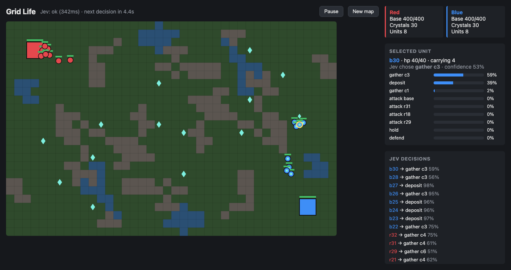
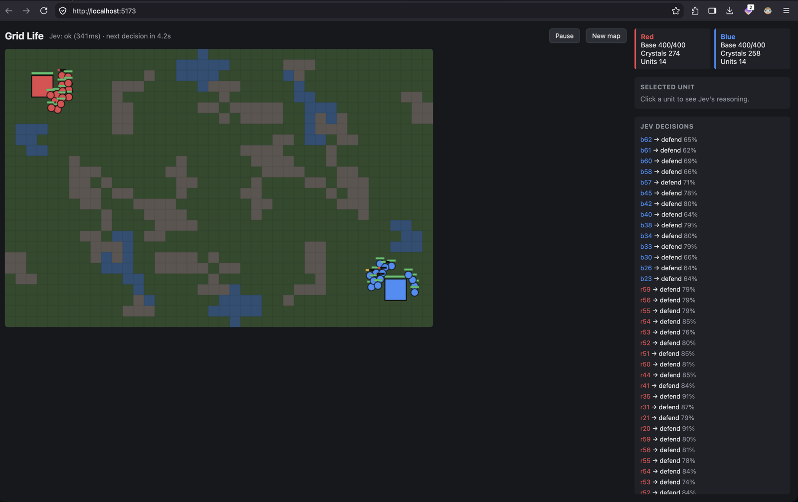
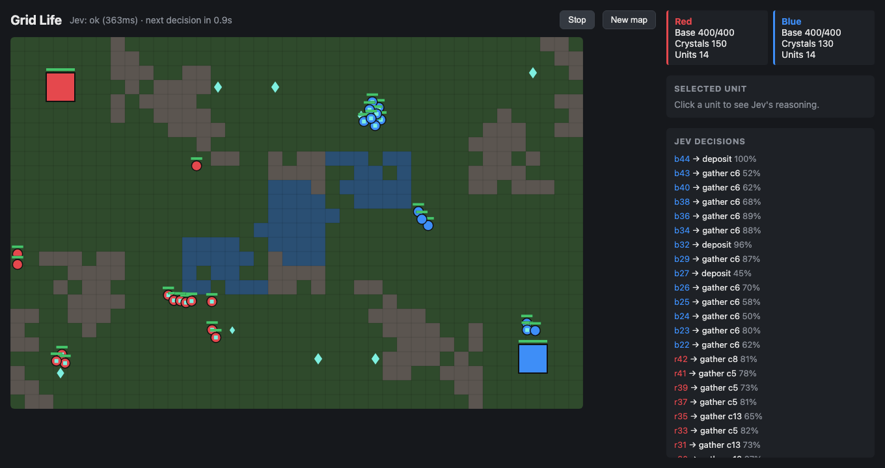
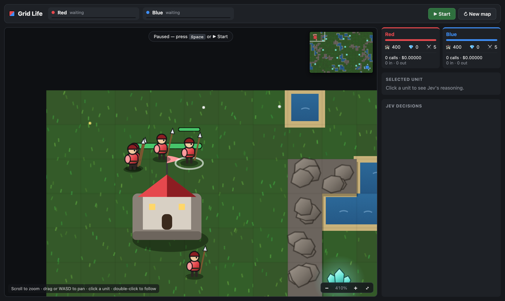
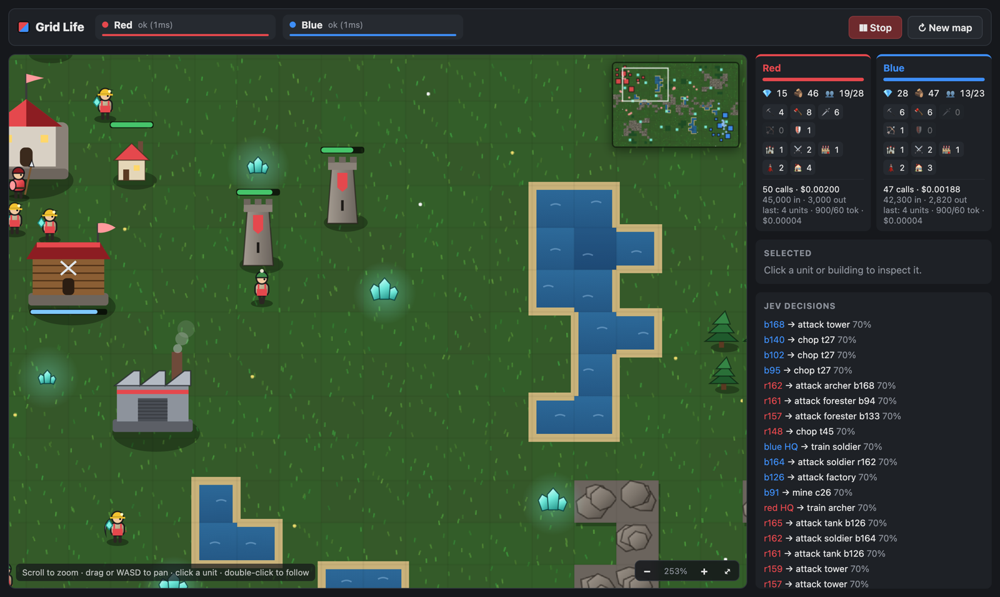
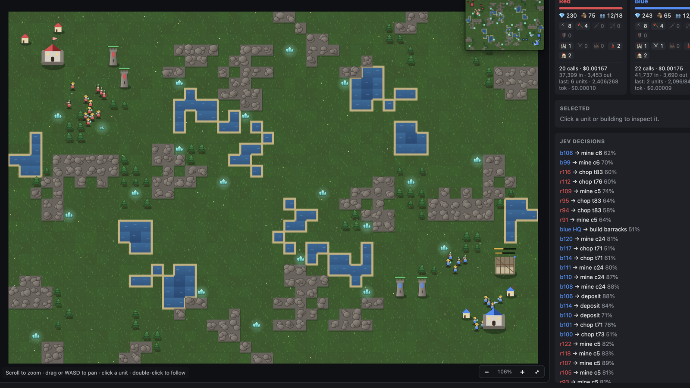
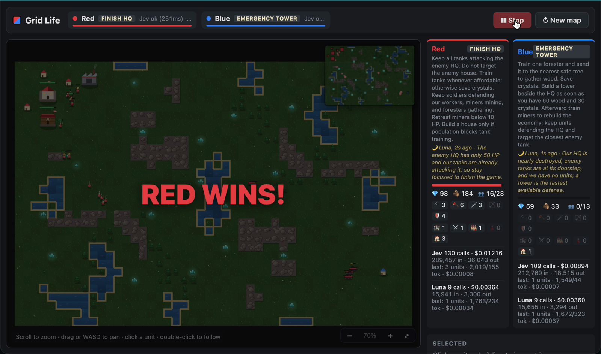

I wanted to build a very basic real-time strategy game, with units moving around a map, and have [Jev](https://openrouter.ai/~typesafe/jev-latest) be the AI. Every five seconds the server would ask Jev what each unit on the page should do.

I built it with Claude Code in one session: a Node server (Node runs TypeScript files natively now, so there's no build step) and a Vite, React and TypeScript frontend. By the end, Jev was controlling miners, foresters, soldiers, archers and tanks on two teams, and GPT Luna was rewriting each team's strategy every 30 seconds.

Here's a full game, from the start to red winning:

<iframe style="width: 100%; aspect-ratio: 16 / 9; border: 0;" src="https://www.youtube-nocookie.com/embed/fQYNJj0Rfa4" title="Jev and Luna playing Grid Life" allow="accelerometer; autoplay; clipboard-write; encrypted-media; gyroscope; picture-in-picture" allowfullscreen></iframe>

## Jev isn't a chat model

My first request to Jev went to OpenRouter's normal chat completions endpoint, and it came back with an error:

```
~typesafe/jev-latest is a decisions model and cannot be used with the
chat/completions endpoint. Use the /api/alpha/decisions endpoint instead.
```

So I worked out the request shape for `/api/alpha/decisions` from its validation errors. Sending an empty body said it needed a `state` (a string, object or array) and a `questions` object. Sending a question without a type said the type had to be `choice`, `score` or `noul`. A `choice` question needs `instructions` and a `criteria` object, where each key is an option and each value describes it.

This was the first request that worked:

```json
{
  "model": "~typesafe/jev-latest",
  "state": { "unit": { "x": 1, "y": 2, "hp": 1, "maxHp": 10 }, "enemy": { "x": 3, "y": 2, "hp": 10 } },
  "questions": {
    "action": {
      "type": "choice",
      "instructions": "What should the unit do?",
      "criteria": { "attack": "charge the enemy", "flee": "run away" }
    },
    "target_x": { "type": "noul", "instructions": "x coordinate to move to (0-20)" }
  }
}
```

And the answer:

```json
{
  "answers": {
    "action": { "type": "choice", "choice": "flee", "probabilities": { "flee": 0.67, "attack": 0.33 }, "confidence": 0.34 },
    "target_x": { "type": "noul", "noul": 0.52 }
  },
  "usage": { "input_tokens": 384, "output_tokens": 51, "cost": 0.000016128 }
}
```

A `noul` answer came back as a number between 0 and 1. I didn't end up using `noul` or `score`. Every decision in the game is a `choice`.

You can put many questions in one request. A test with 16 of them came back in 343ms. Jev also returns a probability for every option, as well as the one it picked, which meant I could show its reasoning for every unit in the UI.

## The first version

The first version had a 40 by 26 grid of grass, rock and water, crystal fields, and two bases. The server runs the game at 10 ticks a second and streams the state to the browser over server-sent events. Every 5 seconds it sent one request per team, with one question per unit. The options were keys like `gather_c3`, `deposit`, `attack_b12`, `attack_base`, `defend` and `hold`, each with a short description.



Clicking a unit showed Jev's probabilities for each of its options, and a log listed every decision as it came in.

## Everyone stood still

When I opened it, the units weren't going anywhere. Every unit on both teams had picked "defend" and was standing at its own base.



I'd tagged whichever option a unit was already doing with "(current order)", and I'd offered "defend" and "hold" at all times. Jev kept choosing to stay put. I removed "hold" and the current-order tag, and only offered "defend" when enemies were near the base.

I also added a Start/Stop button. Up to then the server had been calling Jev in the background whether or not anyone was watching, so now the game starts paused and stops itself when the last browser tab closes.

## Then everyone mined

After that fix every unit went off to gather crystals. Ninety seconds into a test game, both teams were at the 14-unit cap with 130 to 150 crystals banked, and nobody had fought. One unit's answer put 98% on gathering.



Crystals only buy units, so at the cap they're worthless. Once a team hit the cap, I stopped offering gather options. That kept happening through the session: most of my fixes to Jev's behaviour were changes to which options it could pick from.

## Two loops, and fewer tokens

I split the AI into two independent loops, one per team. Each has its own timer and its own request in flight, so both decide at the same time and a slow call for red never holds up blue. I dropped the interval to 3 seconds.

Then I looked at what we were sending. Every unit was asked every round, even a miner halfway through a trip to a crystal field with no enemy in sight, which would get the same answer again. So now a unit is only asked when:

- it's idle,
- an enemy is within 5 tiles, or
- its last decision is 15 seconds old.

I also cut the repetition. Each question's instructions had restated the unit's position, hp, cargo and current order, all of which were already in `state`. That became `Order for our unit r3`. The option descriptions went from sentences like `March on the enemy base (hp {hp}/{maxHp}), {d} tiles away` to `{d} tiles`.

I measured it offline with a stubbed `fetch`, so it cost nothing. The first request of a game went from 4.8k characters to 2.1k. Over five rounds, three sent no request at all because no unit needed a new decision.

OpenRouter returns `input_tokens`, `output_tokens` and `cost` with every answer, so I put running totals and the last request's numbers on each team's card.

## Making it look like a game

Next I asked for zoom, panning and better assets. The map became a canvas you can zoom (scroll or pinch, around the cursor) and pan (drag, or WASD), with a minimap you can click to jump around and a fit-to-screen button. Double-clicking a unit makes the camera follow it.

All the art is drawn in code. The terrain gets rendered once per map at 48 pixels a tile: textured grass, shaded boulders, water with a sandy shore. Crystals glow, water shimmers, and units face the way they're walking.



## More units, more buildings

Then I asked for foresters, miners, soldiers and tanks, and more buildings. The game ended up with two resources and five of each:

- **Miners** mine crystals and **foresters** chop wood. Both are trained at the HQ.
- **Soldiers** fight up close and **archers** shoot from 4 tiles. Both come from a barracks.
- **Tanks** are slow, have 220 hp and do 1.5 times damage to buildings. They come from a factory, which needs a barracks first.
- **Towers** shoot anything within 5 tiles, and each **house** adds 5 to the population cap.

Buildings take time to put up, block movement and can be destroyed. Losing the HQ loses the game. The map grew to 48 by 32 with forests, and each team starts with three miners, two foresters and a soldier.

Jev now runs the economy too. Alongside the unit questions, each request asks "Which unit should we train next?" and "Which building should we construct next?". Only affordable options are offered, plus a "none" option to save up.



Before spending any money on this, I ran whole games offline with a fake Jev that picked options at random. Nobody won in nine minutes of game time. Both teams filled their population with workers, mined the map empty, and built four towers each, which made both bases impossible to attack. So we:

- capped workers at 12 per team,
- gave each HQ a trickle of 1 crystal and 0.5 wood a second, so a mined-out team can still spend,
- only offered houses when the population was within 3 of the cap,
- and limited towers to 2.

## Strategies in plain words

With real Jev playing, both teams did almost the same thing. In this game both sides were mining with over 200 crystals banked, and red hadn't built a barracks.



Jev reads plain language, so I wrote five strategies as plain text and gave each team a different one at random:

- **Rush**: build a barracks immediately, keep only 4 or 5 workers, train soldiers nonstop and attack the enemy HQ early.
- **Turtle**: build both towers early, keep fighters at home, and only attack once we have 3 or more tanks.
- **Armor**: barracks, then a factory as fast as possible, then spend almost everything on tanks.
- **Raider**: mass archers and hunt enemy miners and foresters.
- **Boom**: train workers to the maximum, build houses early, then attack with a big mixed army.

The full text goes into `state`, and every question ends with "Follow our Rush strategy" (or whichever it is). To check it made any difference, I sent the same starting position once under each strategy:

| Strategy | Built / trained | The soldier's order |
|---|---|---|
| Rush | house, soldier | attack |
| Turtle | tower, soldier | defend |
| Armor | factory, miner | defend |
| Raider | barracks, archer | defend |
| Boom | house, miner | defend |

Rush building a house wasn't in its plan, but the other four followed theirs. I also had to make "defend" available to fighters all the time again. Without it, a Turtle had no way to keep its army at home.

## Luna rewrites the plan

A fixed strategy can't react to the game. So I split the thinking into two speeds. Jev keeps steering every unit every 2 seconds. Every 30 seconds, a slower model reads the whole game and rewrites the strategy Jev is following.

For that I used GPT Luna (`~openai/gpt-luna-latest` on OpenRouter) with reasoning effort set to low. Each team has its own Luna loop, and each Luna only sees its own team's view of the game.

The system prompt tells Luna that Jev follows its text word for word every 2 seconds. It lists exactly what Jev can choose from: which units to train, which buildings to build, and the orders a unit can take. It includes the rules, with every unit's and building's hp, damage, range and cost, the worker cap and the population limits. The five preset strategies are there as examples. Luna should keep the strategy if it's working and change it when the situation calls for it, in at most 60 words.

Each time, the user message has Luna's team, the current strategy, a summary (game time, both HQs' hp, both sides' unit and building counts) and the same state Jev gets. The answer comes back as structured output:

```json
{
  "name": "Short strategy name, 1-3 words",
  "strategy": "The instructions Jev will follow, max 60 words",
  "reason": "One sentence on why, given the current state"
}
```

The name and text replace the team's strategy straight away, and the reason shows up under it in the UI. For the first 30 seconds each team runs a random preset, and then Luna takes over.

## The game in the video

The game in the video started as Armor (red) against Rush (blue). Here's what Luna called each side's strategy as the game went on:

| Red | Blue |
|---|---|
| Armor | Rush |
| Armor Tech | Rush |
| Hold and Rebuild | Expand Rush |
| Tank Buildup | Soldier Push |
| Tank Transition | Reinforce |
| Tank Push | Ranged Defense |
| Tank Push | Archer Counter |
| HQ Strike | Tank Defense |
| HQ Assault | Hold the HQ |
| Finish HQ | Emergency Tower |

Near the end, red's tanks reached blue's base. This is what each Luna wrote at that point:


Red's reason was "Three tanks are already at the enemy base, and the enemy has few defenders, so keep pressure on the HQ while expanding population for reinforcements." Blue's was "Three enemy tanks are at our base, while our only units are critically wounded and our resources cannot yet fund a tower or archer."

Red won.



## What it cost

These are the totals on the screen when the game in the video ended. The whole recording is under five minutes, and each Luna made 9 calls at one every 30 seconds, so the game ran for roughly four and a half minutes.

| | Calls | Input tokens | Output tokens | Cost |
|---|---|---|---|---|
| Red, Jev | 130 | 289,457 | 36,043 | $0.01216 |
| Blue, Jev | 109 | 212,769 | 18,515 | $0.00894 |
| Red, Luna | 9 | 15,941 | 3,300 | $0.00364 |
| Blue, Luna | 9 | 15,655 | 3,294 | $0.00360 |
| **Total** | **257** | **533,822** | **61,152** | **$0.02834** |

Split by model:

| | Calls | Cost | Share | Average per call |
|---|---|---|---|---|
| Jev | 239 | $0.02110 | 74% | $0.00009 (about 2,100 tokens in, 230 out) |
| Luna | 18 | $0.00724 | 26% | $0.0004 (about 1,750 tokens in, 370 out) |

Jev is about a quarter of the price per call, but it gets called 13 times as often, so it ends up as three quarters of the bill.

The two costs grow differently. Luna's is fixed by the clock: two teams at one call every 30 seconds is 4 calls a minute, whatever is happening in the game. Jev's depends on the game. Each request has a question for every unit that needs a new order, plus the train and build questions, and the state lists every unit and building on the map. A bigger army means bigger requests. Red's Jev bill was higher than blue's, and red had the bigger army most of the way through: 13 units to blue's 10 about three minutes in, and 16 to none at the end. Red's Jev output was nearly double blue's.

Jev is also skipped when there's nothing to ask. Two teams every 2 seconds could be up to about 270 requests in four and a half minutes, and the game sent 239.

At the rate in this game, one session works out at about 0.6 cents a minute: roughly 0.47 cents for Jev and 0.16 cents for Luna. That's around 38 cents an hour, if a game went on that long.

## What I learned

- Jev is a decisions model with its own endpoint. You send a state plus a set of questions, each with named options, and you get back a choice and a probability for every option. Many questions fit in one request.
- Most of my fixes to Jev's behaviour were changes to the options. Removing "hold" and limiting "defend" got units moving. Removing "gather" at the unit cap got them fighting. Offering "defend" all the time let a Turtle keep its army at home.
- Plain-language strategy does steer it. The same position under five strategies gave five different sets of choices.
- A slow model rewriting the strategy every 30 seconds, and a fast one following it every 2 seconds, is cheap. A whole game cost under three cents.
- A fake Jev that picks at random is a free way to find stalemates before spending anything.
