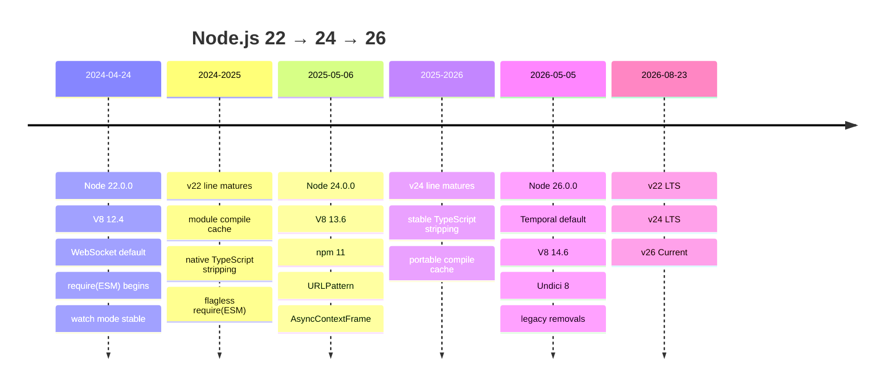
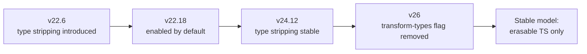

# Node.js v22, v24 and v26: A Rigorous Comparative Analysis

## Executive summary

Node.js v22, v24 and v26 form a clear progression from **module-system modernisation**, through **tooling and Web-platform consolidation**, to **runtime modernisation and removal of legacy compatibility layers**.

As of **23 August 2026**, Node.js **v22 (“Jod”) is an LTS line**, **v24 (“Krypton”) is the latest LTS line**, and **v26 is the Current line**, with v26 scheduled to enter LTS in October 2026. The Node project lists v24.19.0 as the latest LTS release and v26.7.0 as the latest Current release. citeturn19view3

My practical assessment is:

| Version | Best characterised as | Best fit in August 2026 |
|---|---|---|
| **Node 22** | The interoperability release: WebSocket, stable watch mode, `require(esm)`, `node --run`, `fs.glob`, compile cache, and the beginning of native TypeScript execution | Existing LTS estates; a sensible minimum target for libraries needing modern ESM/CJS interoperability |
| **Node 24** | The consolidation release: V8 13.6, npm 11, `URLPattern`, better `AsyncLocalStorage`, improved test runner semantics, stable built-in TypeScript stripping later in the line | **Default production choice** today where LTS is preferred |
| **Node 26** | The modernisation release: Temporal by default, V8 14.6, Undici 8, stronger permission controls and diagnostics, simpler SEA packaging, and more aggressive legacy removals | Evaluation/new development where v26-specific capabilities matter; production adoption should account for its Current status until October 2026 |

That positioning follows both the current support status and the magnitude of behavioural change in each line. citeturn19view3turn20view5turn20view0turn20view3

The most consequential changes are not necessarily the most eye-catching language features:

**Node 22** fundamentally improves ESM/CJS coexistence. It introduced synchronous loading of eligible ES modules with `require()`, enabled the browser-compatible `WebSocket` API by default, made watch mode stable, added `node --run`, introduced `fs.glob()`/`globSync()`, enabled V8's Maglev compiler on supported architectures, and later in the v22 line introduced native TypeScript type stripping and an on-disk module compile cache. citeturn20view5turn19view4turn19view5

**Node 24** is the strongest all-round upgrade for mainstream applications. V8 13.6 exposes `Float16Array`, explicit resource management, `RegExp.escape()`, WebAssembly Memory64 and `Error.isError()`; npm moves to major version 11; `URLPattern` becomes global; `AsyncLocalStorage` adopts `AsyncContextFrame`; and the native test runner automatically waits for subtests. Later v24 releases make Node's built-in TypeScript type stripping stable and make the module compile cache portable across changed project paths. citeturn20view0turn19view4turn19view5

**Node 26** brings the clearest JavaScript-language delta: `Temporal` is enabled globally by default, while V8 14.6 supplies Map/WeakMap upsert methods and `Iterator.concat()`. It also moves to Undici 8, adds runtime permission revocation in v26.3, improves inspector/coverage tooling, and, because the v26 line inherits functionality introduced during v25, can build single-executable applications directly with `node --build-sea`. Conversely, it removes more legacy APIs, drops `--experimental-transform-types`, stops bundling Corepack, raises source-build requirements and changes the non-Node-API native-addon ABI again. citeturn20view3turn14search1turn22search0turn14search2turn20view4

A particularly important conclusion is that **“version capability” and “feature introduction” are not the same thing**. Node routinely backports safe features to maintained LTS lines. For example, TypeScript stripping first appeared in v22.6.0, became enabled by default in v22.18.0, but did not become stable until v24.12.0; `import.meta.main` appeared in v24.2.0 and was also backported to v22.18.0. citeturn19view4turn7search1 The report therefore distinguishes features introduced by a `.0.0` major release from capabilities available in that major line by 23 August 2026.



## Scope and release baseline

For “what can you do that you could not do in the previous version?”, this report compares the **even-numbered production-oriented generations**: v22 against v20, v24 against v22, and v26 against v24. This is more useful than treating v23 and v25 as deployment baselines because both odd-numbered lines are already EOL, while v22 and v24 are LTS and v26 is the current even-numbered successor. citeturn19view3

There are two timelines to keep in mind:

1. **Major-release delta** means a change shipped in v22.0.0, v24.0.0 or v26.0.0 and therefore belongs semantically to that major transition.
2. **Current major-line capability** means something available in a later v22.x, v24.x or v26.x release by 23 August 2026. This matters substantially for TypeScript, ESM interoperability, compile caching, SEA and diagnostics. citeturn19view4turn15search0turn19view5turn22search0

This distinction prevents several common but inaccurate claims. For example, saying merely “Node 22 supports TypeScript” hides the fact that v22.0.0 did not: type stripping arrived in **v22.6.0** and became default only in **v22.18.0**. Likewise, direct SEA construction with `--build-sea` is a capability of Node 26, but it technically first landed in **v25.5.0**, rather than v26.0.0. citeturn19view4turn22search0

The three major releases also represent three substantial V8 jumps:

| Node line | V8 at `.0.0` | Notable JavaScript/Wasm consequences |
|---|---:|---|
| v22 | 12.4 | `Array.fromAsync`, newer Set functionality, iterator functionality, WebAssembly GC; Maglev enabled by Node on supported architectures |
| v24 | 13.6 | `Float16Array`, explicit resource management, `RegExp.escape`, Wasm Memory64, `Error.isError` |
| v26 | 14.6 | Map/WeakMap upsert APIs, `Iterator.concat()`, plus the V8 generation in which Node enables Temporal by default |

Node's v22 announcement and V8's own retrospective document the V8-era additions including `Array.fromAsync` and WebAssembly GC; Node's v24 and v26 release notes explicitly enumerate their V8-delivered APIs. citeturn18search9turn17search0turn20view0turn20view3

There is **no meaningful universal “Node 24 is X% faster than Node 22” or “Node 26 is Y% faster than Node 24” figure specified by the release notes**. Performance depends heavily on startup profile, module graph, HTTP patterns, allocation behaviour, architecture, native dependencies and workload. Where the project identifies specific performance mechanisms—Maglev, compile caching, `AsyncContextFrame`, Undici changes or Buffer pooling—those are more useful than an invented aggregate percentage. citeturn20view5turn19view5turn20view0turn14search1

## Node.js v22

Node 22.0.0 shipped on **24 April 2024**. Its defining theme is making Node feel less divided between “old Node” conventions and modern JavaScript/Web conventions: ESM becomes easier to consume from CommonJS, browser-style WebSocket support becomes built in, watch mode becomes production-quality tooling, and ordinary development commands increasingly need fewer external packages. citeturn19view0turn20view5

| Area | Major v22 change | Impact |
|---|---|---|
| JavaScript engine | V8 upgraded to **12.4**; Maglev enabled on supported architectures | Faster tier-up can particularly benefit relatively short-lived workloads and CLI applications; modern JS/Wasm features arrive with the engine. citeturn20view5turn18search9 |
| Web APIs | Global `WebSocket` client enabled by default | WebSocket clients no longer inherently require `ws` or another package merely to obtain a client API. citeturn20view5 |
| ESM/CJS | Synchronous `require()` of eligible ESM graphs introduced | CommonJS consumers can synchronously consume ESM that contains no top-level `await`; initially experimental. citeturn20view5turn15search0 |
| CLI tooling | Watch mode marked stable | `node --watch app.js` becomes a first-party restart-on-change workflow. citeturn20view5 |
| CLI tooling | `node --run <script>` added | A package.json script can be invoked directly by Node rather than necessarily going through `npm run`. citeturn19view0 |
| Filesystem | `fs.glob()` and `fs.globSync()` exposed | Basic file globbing becomes available in core. citeturn20view5 |
| Streams | Default `highWaterMark` increased | Code sensitive to stream buffering, memory use or back-pressure thresholds needs revalidation. citeturn20view5 |
| ESM syntax | Import assertions support dropped | Code using old `assert { type: ... }` syntax must move to import attributes. citeturn20view5turn7search1 |
| Deprecations | Direct `fs.Stats`, `Hash` and `Hmac` construction and `util.isArray()` became runtime-deprecated | Applications relying on old constructors/utilities start producing deprecation warnings and should migrate to supported factory/standard APIs. citeturn20view6turn21search0 |
| Native/build | Windows Node builds moved to C++20; `NODE_MODULE_VERSION` became **127** | Direct V8/Node C++ addons need testing/rebuilding; source-build toolchains need C++20 capability. citeturn20view5turn9view0 |

The `require(esm)` evolution is especially important. In v22.0.0 the facility was introduced behind `--experimental-require-module`; from **v22.12.0** it no longer required that flag, and from **v22.13.0** it stopped emitting the experimental warning by default. It is deliberately limited to synchronous module graphs: if the target or anything it imports contains top-level `await`, `require()` throws `ERR_REQUIRE_ASYNC_MODULE`, and the consumer should use dynamic `import()` instead. citeturn15search0

That means a CommonJS application can now do something like:

```js
// math.mjs
export const square = x => x * x;

// app.cjs — Node 22.12+ without the experimental flag
const { square } = require('./math.mjs');

console.log(square(5)); // 25
```

This materially reduces the “ESM-only dependency breaks my CommonJS application” problem, but does **not** make asynchronous ESM synchronously loadable. It also returns a module namespace object; a default export appears at `.default` unless the ESM package uses the special `"module.exports"` interop export supported from v22.12.0. That special export can itself be a pitfall because named exports are not automatically retained for CommonJS consumers. citeturn15search0

The complementary module-system change is syntax detection. From **v22.7.0**, Node enables syntax detection by default for ambiguous JavaScript input that lacks explicit package-type metadata. It may parse such code to determine whether it contains ESM-only syntax. Package authors should nevertheless specify `"type": "module"` or `"type": "commonjs"` rather than depend on detection, both to make intent unambiguous and to avoid unnecessary interpretation work. citeturn7search2

Node 22 also removes the need for a third-party WebSocket client in straightforward cases:

```js
const socket = new WebSocket('wss://example.com/socket');

socket.addEventListener('open', () => {
  socket.send(JSON.stringify({ type: 'hello' }));
});

socket.addEventListener('message', event => {
  console.log(event.data);
});
```

`WebSocket` being enabled globally by default is a v22.0.0 change; it complements Node's existing browser-style networking APIs rather than replacing specialised packages whose reconnection, server or protocol features may still be needed. citeturn20view5

Two deceptively valuable developer-experience additions are:

```bash
node --watch src/server.js
node --run build
```

and:

```js
import { globSync } from 'node:fs';

const tests = globSync('test/**/*.test.js');
```

The former gives Node-native watch/restart and package-script invocation, while the latter moves common filesystem discovery into core. citeturn20view5turn19view0

### TypeScript and compile caching inside the v22 line

The v22 family changed considerably after 22.0.0. **Built-in TypeScript type stripping arrived in v22.6.0**, `--experimental-transform-types` followed in v22.7.0, and in **v22.18.0** stripping became enabled by default and stopped producing the ordinary experimental warning. citeturn19view4

Thus, on v22.18+:

```ts
// app.ts
type User = {
  id: number;
  name: string;
};

const user: User = { id: 1, name: 'Ada' };
console.log(user.name);
```

can run as:

```bash
node app.ts
```

without first invoking `tsc`. However, this is **not a TypeScript compiler**. Node strips erasable type syntax, performs no type checking, ignores `tsconfig.json`, and does not provide features that depend upon TypeScript emitting transformed JavaScript. Node recommends TypeScript 5.8+ settings including `module: "nodenext"`, `erasableSyntaxOnly` and `verbatimModuleSyntax` when designing code for this model. citeturn19view4

That distinction matters enormously in migration planning: native execution is good for scripts, tests and projects deliberately written in erasable TypeScript, but `tsc`, `tsx` or another transformer remains appropriate when you rely on full TypeScript syntax, path mappings, down-level compilation or actual static type checking. citeturn19view4

The other major later-v22 feature is the **module compile cache**, initially added in **v22.1.0**, with JavaScript APIs arriving in v22.8.0. Once enabled, Node persists V8 code cache for CommonJS, ESM and TypeScript modules. The first load may actually be slower because the cache must be generated, but later launches of an unchanged module graph can receive significant compilation-time savings. The cache is generally Node-version-specific. citeturn19view5

```js
import { enableCompileCache } from 'node:module';

enableCompileCache();
```

or:

```bash
NODE_COMPILE_CACHE=/tmp/my-node-cache node app.js
```

is therefore particularly interesting for CLIs, worker processes and repeatedly started applications. The important testing caveat is that V8 code coverage can become less precise for functions deserialised from cached code, so Node recommends disabling this optimisation while collecting precise coverage. citeturn19view5

**What v22 lets you do, compared with v20:** use a built-in WebSocket client by default; run package scripts with `node --run`; use first-party globbing; use stable watch mode; synchronously `require()` suitable ESM graphs; use Node-managed module compilation caching; and, in later v22 releases, directly execute a useful subset of TypeScript. citeturn20view5turn19view4turn19view5

## Node.js v24

Node 24.0.0 shipped on **6 May 2025**. Compared with v22, it is less about one revolutionary module change and more about making recent innovations feel coherent and production-ready: newer ECMAScript syntax, npm 11, a stronger Web-platform surface, more reliable asynchronous context propagation and simpler test semantics. citeturn20view0

| Area | Major v24 change | Impact |
|---|---|---|
| JavaScript engine | V8 **13.6** | Adds `Float16Array`, explicit resource management, `RegExp.escape()`, WebAssembly Memory64 and `Error.isError()`. citeturn20view0 |
| Package tooling | **npm 11** | Package-manager major changes enter the standard Node distribution; CI/install behaviour should be tested rather than assuming npm 10 equivalence. citeturn20view0 |
| Async context | `AsyncLocalStorage` defaults to `AsyncContextFrame` | Node describes this as a more efficient and robust implementation for async context tracking. citeturn20view0 |
| Web APIs | `URLPattern` becomes global | URL routing/pattern matching can use the Web API directly without an external implementation or explicit core import. citeturn20view0 |
| Security | Permission Model CLI moves towards ordinary `--permission` usage | The capability becomes more normalised as a supported runtime control rather than an obviously experimental workflow. citeturn20view0turn14search0 |
| Testing | Parent tests automatically wait for subtests | Less manual promise coordination, but a breaking semantic change for code expecting `test()`/`t.test()` to return promises. citeturn20view0turn12view1 |
| HTTP client/Web APIs | Undici **7** | Node's underlying fetch/HTTP client implementation moves to a new major. citeturn20view0 |
| Deprecation | `url.parse()` runtime-deprecated | Modern code should use WHATWG `URL`. citeturn20view0 |
| Removal | `tls.createSecurePair` / `tls.SecurePair` removed | Legacy TLS code must use `TLSSocket`. citeturn20view0turn21search0 |
| Deprecations | `SlowBuffer`, zlib/repl construction without `new`, shell-mode `spawn`/`execFile` argument patterns | Older API patterns begin warning or disappear; shell arguments receive particular attention because of injection risk. citeturn20view0turn21search0 |
| Native/build | `NODE_MODULE_VERSION` **137**; ARMv7 downgraded; Windows/macOS source-build requirements tightened | Native-addon and source-build CI requires validation. citeturn20view2turn12view1 |

### New JavaScript capabilities

`URLPattern` is one of the most immediately useful v24 additions:

```js
const users = new URLPattern({
  pathname: '/users/:id'
});

const match = users.exec('https://example.com/users/42');

console.log(match.pathname.groups.id); // "42"
```

This provides a standard URL-aware matcher instead of having to approximate routing with hand-written regular expressions. citeturn20view0

`RegExp.escape()` solves another mundane but security- and correctness-relevant problem:

```js
const query = 'file[1].txt';

const exactName = new RegExp(
  `^${RegExp.escape(query)}$`
);
```

Rather than maintaining an error-prone userland escaping expression, applications can escape literal text using the language's built-in operation. `RegExp.escape()` arrives through V8 13.6. citeturn20view0

Explicit resource management also means JavaScript can express lexical disposal:

```js
class Resource {
  [Symbol.dispose]() {
    console.log('released');
  }
}

{
  using resource = new Resource();
  // use resource
} // Symbol.dispose is invoked
```

This is a substantial language-level improvement for objects whose lifetime should match a lexical block, analogous in intent to RAII/context-manager patterns in other languages. Node 24's V8 13.6 enables the explicit resource management proposal. citeturn20view0

For numerical and Wasm workloads, `Float16Array` and WebAssembly Memory64 are potentially more significant than the application-level APIs. Their benefit is workload-specific; the Node release does not specify a general application performance percentage attributable to them. citeturn20view0

### Test-runner semantics are a real breaking change

The native `node:test` runner already existed before v24, but v24 changes a subtle contract: it **automatically waits for subtests and `test()`/`t.test()` no longer return promises in the previous way**. citeturn20view0turn12view1

The intended style becomes:

```js
import test from 'node:test';
import assert from 'node:assert/strict';

test('parent', t => {
  t.test('child', () => {
    assert.equal(2 + 2, 4);
  });

  // The parent automatically waits for the child.
});
```

This eliminates one common source of incorrectly detached subtests. Conversely, abstractions that did things such as `return t.test(...).then(...)` need rewriting; treating this as a purely additive enhancement risks unexpected failures. citeturn20view0turn12view1

### TypeScript reaches a much better production posture

The built-in TypeScript support that began in v22 crosses an important maturity threshold in the v24 line. At **v24.12.0, type stripping is marked stable**. Node still performs only stripping of erasable syntax, still ignores `tsconfig.json`, and still performs no type checking; “stable” describes the runtime facility, not full TypeScript-language parity with `tsc`. citeturn19view4

This makes v24 significantly more comfortable than v22 for organisations deliberately adopting “TypeScript as erasable JavaScript plus annotations”:

```ts
interface Config {
  port: number;
}

const config: Config = { port: 8080 };

console.log(config.port);
```

The operational model can be:

```bash
# Runtime execution
node src/app.ts

# Separate static validation
tsc --noEmit
```

This separation—Node for execution, TypeScript for static analysis—is often the cleanest way to understand the feature. citeturn19view4

### Module and packaging maturity

Node 24 does not replace v22's ESM/CJS breakthrough; it inherits and matures it. By the later v22 line, `require(esm)` was already flagless and quiet, `import.meta.dirname`/`filename` had also been backported, and `import.meta.main` was added to both maintained generations. This is a good example of why “feature X belongs exclusively to Node 24” can be misleading when Node backports safe module improvements. citeturn15search0turn7search1

The module compile cache also improves in **v24.12.0** with a portable mode:

```js
import { enableCompileCache } from 'node:module';

enableCompileCache({
  directory: '/cache/node',
  portable: true
});
```

Normal compile caches are sensitive to absolute project paths; portable mode is intended to allow reuse when the project is moved while retaining the same relative layout. It remains a best-effort optimisation, and caches from one Node version should not be expected to work in another. citeturn19view5

### Important removals and deprecations

Several v24 changes deserve more attention than a typical release-summary bullet:

`url.parse()` becomes runtime-deprecated, making the WHATWG `URL` API the clear migration target. `tls.SecurePair` reaches end-of-life. `dirent.path` is removed in favour of `dirent.parentPath`. Calling `fs.truncate()` with an fd is removed. Direct `fs.F_OK`, `R_OK`, `W_OK` and `X_OK` access is deprecated in favour of `fs.constants.*`. citeturn20view0turn20view2turn21search0

The deprecation of using `child_process.spawn()` or `execFile()` with an `args` array and `{ shell: true }` is especially noteworthy: Node's deprecation documentation explicitly identifies the underlying risk that the arguments are space-separated rather than safely escaped, making shell injection possible when values are untrusted. citeturn21search0

**What v24 gives you that v22 does not at the same baseline:** global `URLPattern`, V8 13.6 language/Wasm features such as `RegExp.escape()` and `using`, npm 11, the new `AsyncContextFrame`-based asynchronous-context implementation and auto-waiting test subtests. By later v24.x, it also gives a formally stable form of built-in TypeScript stripping and portable module compile caching. citeturn20view0turn19view4turn19view5

## Node.js v26

Node 26.0.0 shipped on **5 May 2026**. It is a more aggressive major transition than v24 because it combines important new language functionality with meaningful legacy removal. As of 23 August 2026 it remains the Current line and is expected to move to LTS in October 2026. citeturn19view2turn19view3

| Area | Major v26 change | Impact |
|---|---|---|
| Date/time | **Temporal enabled by default** | First-class date, time-zone, duration and calendar-aware operations become a built-in JavaScript capability without a flag/polyfill. citeturn20view3turn16search0 |
| JavaScript engine | V8 **14.6.202.33** | Adds Map/WeakMap upsert methods and `Iterator.concat()`. citeturn20view3 |
| HTTP/Web APIs | Undici **8.0.2** at v26.0 | Node's fetch/HTTP client stack advances another major generation. citeturn20view3 |
| TypeScript | `--experimental-transform-types` removed | Built-in Node execution is now clearly centred on erasable TypeScript rather than runtime code-generating TS transforms. citeturn20view4turn19view4 |
| Modules | `module.register()` runtime-deprecated | Loader authors should assess migration to newer `module.registerHooks()` APIs where their synchronous semantics fit. citeturn20view4turn21search0 |
| HTTP | `http.Server.prototype.writeHeader()` removed | Use the supported `writeHead()` API. citeturn20view3 |
| Streams | Legacy private `_stream_*` modules removed | Packages importing Node internals rather than public `node:stream` APIs can break outright. citeturn20view3 |
| Crypto | Short GCM tags without explicit `authTagLength` reach EOL | Applications using short AES-GCM authentication tags must explicitly declare the intended length. citeturn21search0 |
| Crypto | Passing `CryptoKey` to certain `node:crypto` APIs / `KeyObject.from(non-extractable CryptoKey)` runtime-deprecated | WebCrypto/Core crypto boundary code needs review. citeturn21search0 |
| Build | GCC minimum becomes **13.2** and Python 3.9 source-build support is dropped | Relevant to teams compiling Node themselves or maintaining bespoke distributions. citeturn20view4 |
| Native addons | `NODE_MODULE_VERSION` becomes **147** | Non-Node-API binary addons generally need a v26-compatible build. citeturn9view2 |

### Temporal is the headline capability

Temporal is not merely a prettier `Date`. TC39 designed it around first-class time zones, DST-aware arithmetic, immutable values, distinct date/time/duration types, standards-oriented serialisation and non-Gregorian calendars. citeturn16search0turn16search1

For example:

```js
const meeting = Temporal.ZonedDateTime.from(
  '2026-10-25T09:30[Europe/London]'
);

const later = meeting.add({ hours: 3 });

console.log(later.toString());
```

A `Temporal.ZonedDateTime` preserves a time-zone identifier and its arithmetic accounts for time-zone rules, making it far more appropriate than hand-manipulating milliseconds for calendrical applications. citeturn16search4

For elapsed or calendar-relative intervals:

```js
const duration = Temporal.Duration.from({
  days: 2,
  hours: 5
});

console.log(duration.toString());
```

Temporal's standard types make distinctions such as “calendar date”, “instant”, “zoned date/time” and “duration” explicit rather than overloading one mutable `Date` abstraction. citeturn16search0turn16search3

This is arguably the clearest **v26-only reason** among the three compared baselines: v22 and v24 do not enable Temporal globally by default, whereas v26 does. citeturn20view3

### V8 14.6 adds useful collection primitives

The Map upsert APIs remove a recurring lookup/check/insert pattern:

```js
const cache = new Map();

function getRecord(id) {
  return cache.getOrInsertComputed(
    id,
    () => loadRecord(id)
  );
}
```

Likewise, V8 14.6 makes `Iterator.concat()` available for sequencing multiple iterable sources. Both are explicitly listed in Node 26.0.0's V8 14.6 upgrade notes. citeturn20view3

These are modest-looking additions, but `getOrInsertComputed()` is valuable because cache initialisation no longer needs the conventional:

```js
if (!cache.has(key)) {
  cache.set(key, compute(key));
}

const value = cache.get(key);
```

pattern, which performs separate existence/retrieval operations and is easier to implement inconsistently.

### TypeScript becomes simpler—and more restrictive

Node 26 makes an important policy choice by removing `--experimental-transform-types`. Built-in execution remains stable, but the supported model is **type stripping of syntax that needs no generated JavaScript**. citeturn19view4turn20view4

This remains fine:

```ts
type Point = { x: number; y: number };

const point: Point = {
  x: 10,
  y: 20
};
```

But code that depends on TypeScript-specific syntax requiring runtime emission should not assume Node will transform it. The migration strategy is either to rewrite such source into erasable TypeScript or continue using `tsc`, `tsx`, another loader/transpiler, or a build step. Node's own documentation explicitly recommends third-party tooling when full TypeScript syntax or `tsconfig.json`-dependent behaviour is required. citeturn19view4

This means v26 is simultaneously **more mature** for native TypeScript and **less permissive** than the experimental transformation route available earlier: the feature's intended scope is now clearer.

### Security and permissions improve during the v26 line

The Permission Model itself predates v26 and was already marked stable in v22.13.0, but the v26 line adds **`process.permission.drop()` in v26.3.0**, allowing a process to irreversibly relinquish a permission after startup. citeturn14search0turn14search1

For example:

```bash
node \
  --permission \
  --allow-fs-read=/etc/myapp \
  app.js
```

```js
import fs from 'node:fs';

const config = fs.readFileSync(
  '/etc/myapp/config.json',
  'utf8'
);

// Initialisation is done: permanently give up that grant.
process.permission.drop('fs.read', '/etc/myapp');
```

Dropping a permission only affects future checks; it **does not revoke already-open descriptors, sockets, child processes or workers**. citeturn14search0

An equally important caveat is that Node explicitly describes its Permission Model as a **“seat belt”, not a sandbox for hostile code**. Node warns that malicious code can bypass the model and that OS-level isolation remains necessary when dealing with untrusted code. That distinction should prevent teams from treating `--permission` as the equivalent of containers, seccomp/AppArmor, separate users or a hardened process sandbox. citeturn14search0

v26.3 also included WebCrypto hardening against prototype pollution and exposed precise inspector coverage controls; these are meaningful security/diagnostic refinements beyond the v26.0 headline features. citeturn14search1

### Diagnostics and performance continue moving

Later v26 releases add useful operational capabilities. v26.3 increased the default `Buffer.poolSize` to **64 KiB**, added inspector precise-coverage support, and added runtime permission dropping. The larger Buffer pool can alter allocation and memory characteristics in applications that make many small Buffer allocations, so performance-sensitive systems should benchmark rather than assume the change is universally beneficial. citeturn14search1

The v26 line also adds newer native-test-runner capabilities such as test randomisation in v26.1, while v26.7 adds `--test-coverage-include-all`; v26.7 also adds Perfetto support to Node's diagnostics stack. These are useful for exposing ordering assumptions and improving low-level runtime analysis. citeturn5search2turn5search0

No universal performance improvement for v26 versus v24 is specified. The measurable result depends on workload, and upgrades to V8, Undici, Buffer pooling and internal runtime code can help different applications in different ways. A controlled benchmark against the actual service/CLI/test workload remains necessary. citeturn20view3turn14search1

### Packaging changes materially in v26

Single Executable Applications have existed experimentally since older Node releases, but current v26 has a major usability advantage: **`node --build-sea` can directly create the executable**, a feature first added in v25.5.0 and inherited by v26. v22/v24-era SEA workflows rely on generating a preparation blob and externally injecting it into a Node executable. citeturn22search0

A v26 SEA configuration can resemble:

```json
{
  "main": "./dist/app.js",
  "output": "./my-app",
  "useCodeCache": true,
  "assets": {
    "config.json": "./config.json"
  }
}
```

and be built with:

```bash
node --build-sea sea-config.json
```

The facility remains marked **active development**, and there are important constraints: code cache/snapshots are platform-specific, and the Node binary used to create relevant artefacts must match the target expectations. citeturn22search0

The packaging trap going in the opposite direction is **Corepack**. Corepack's official documentation states that it is distributed with Node from 14.19.0 **up to, but not including, 25.0.0**. Therefore v22 and v24 installations may provide Corepack, while v26 does not. CI images that blindly execute `corepack enable` after a 24→26 upgrade can consequently fail unless Corepack or the chosen package manager is installed separately. citeturn14search2

**What v26 lets you do compared with v24:** use Temporal globally without a runtime flag; use V8 14.6 collection/iterator operations; drop previously granted Node permissions at runtime; use the newer Undici 8 generation; take advantage of newer diagnostics and test functionality; and directly build SEA executables through the built-in CLI. At the same time, v26 deliberately stops supporting several transitional or legacy behaviours, so the upgrade has a larger migration surface than 22→24. citeturn20view3turn14search1turn22search0

## Runtime, tooling and ecosystem comparison

The biggest practical differences emerge when the individual feature lists are viewed by subsystem.

### TypeScript

The progression is unusually clear:



Node's built-in TypeScript support is therefore not a replacement for the TypeScript compiler. Across all three lines it is best understood as **runtime parsing plus removal of type-only syntax**. No type checking occurs; `tsconfig.json` is ignored; full language transformations require an external tool. citeturn19view4

For a library or service already compiling TypeScript to JavaScript, upgrading Node does not inherently justify deleting the build step. The strongest candidates for buildless execution are scripts, test files, CLIs and applications intentionally constrained to erasable syntax. citeturn19view4

### Native test runner

All three generations have `node:test`; the differentiator is the quality and semantics around it. v22 adds enhancements on top of an already usable test runner. v24 changes subtest lifecycle handling so parents wait automatically and test/subtest calls no longer expose the same promise contract. v26 continues adding test randomisation, timer/mocking improvements and broader coverage controls. citeturn12view0turn20view0turn5search2turn5search0

That evolution makes `node:test` increasingly credible as a no-dependency or low-dependency test stack, but v24's return-value change means teams with wrappers around `t.test()` should treat the test suite itself as upgrade-sensitive application code. citeturn20view0turn12view1

### ESM/CJS interoperability

v22 is the decisive release here. Synchronous `require(esm)` enters in 22.0, becomes flagless in 22.12 and quiet by default in 22.13. It supports `.mjs`, `"type": "module"` sources and syntax-detected ESM, but only when the complete dependency graph is synchronous. citeturn15search0

Other v22-line changes move ESM further towards maturity: import assertions disappear in favour of import attributes; JSON modules and import attributes lose their experimental status in v22.12; `import.meta.dirname` and `import.meta.filename` lose experimental status in v22.16; `import.meta.main` arrives in v22.18 as well as v24.2; and WebAssembly ESM imports become unflagged in v22.19/v24.5. citeturn7search1

The migration lesson is that **explicit package metadata remains preferable** despite these improvements. A project should not remove `"type"` simply because Node can syntax-detect ambiguous `.js`; explicit module boundaries are easier for Node, bundlers, editors and other runtimes to reason about. citeturn7search2

v26 then starts cleaning up the loader mechanism itself: `module.register()` is runtime-deprecated in favour of the newer hook architecture. `module.registerHooks()` provides synchronous, in-thread hooks, while older asynchronous loader hooks have different execution semantics, so sophisticated custom loaders should not assume migration is a literal rename. citeturn20view4turn19view5

### Web APIs and networking

The evolution is:

**v22:** `WebSocket` on by default, giving Node a browser-compatible client primitive. citeturn20view5

**v24:** `URLPattern` becomes global and Undici advances to major 7; at the same time Node makes legacy `url.parse()` a runtime deprecation, reinforcing WHATWG `URL` as the intended URL model. citeturn20view0

**v26:** Undici moves to major 8.0.2 at launch. Applications heavily dependent on edge-case `fetch`, streams, proxy, HTTP-header or connection-pooling behaviour should integration-test rather than assuming all underlying HTTP-client semantics are frozen across an Undici major. citeturn20view3

### Security

The Permission Model is stable from v22.13.0, v24 presents it as an increasingly mainstream `--permission` facility, and v26.3 adds irreversible runtime permission dropping. Its scope now includes controls around filesystem, network, child processes, workers, native addons, WASI, FFI and inspector-related functionality. citeturn14search0

v24's child-process deprecation is also security-relevant because of shell-injection semantics. v26 tightens crypto behaviour further: short AES-GCM tags without an explicit `authTagLength` are no longer accepted under the old compatibility exception, and WebCrypto receives prototype-pollution hardening in v26.3. citeturn21search0turn14search1

These measures improve safe-by-default behaviour, but they do not make version selection itself a security boundary. The supported patch level of whichever major you deploy matters at least as much as choosing 22 versus 24 versus 26. As of the date of this report all three lines remain supported/current according to Node's release page. citeturn19view3

### Performance and diagnostics

v22 has the most explicit startup/performance story: Maglev becomes enabled on supported architectures and the module compile cache provides persistent V8 code caching. The cache's strongest expected gains are after the first run, while initial compilation can be slower. citeturn20view5turn19view5

v24 changes the implementation behind `AsyncLocalStorage` to `AsyncContextFrame`, which Node describes as more efficient and robust. This is especially relevant to telemetry, tracing and request-context frameworks, where `AsyncLocalStorage` is heavily used even if application authors interact with it only indirectly through an observability library. citeturn20view0

v26 combines further engine evolution with inspector precise coverage, Perfetto integration and changes such as a larger Buffer pool. This makes v26 particularly interesting for performance investigations, but it also means allocation-sensitive or diagnostic tooling deserves regression testing. citeturn14search1turn5search0

### Build, packaging and native addons

The native-addon story is perhaps the cleanest migration-risk indicator:

| Node | `NODE_MODULE_VERSION` |
|---|---:|
| v22 | **127** |
| v24 | **137** |
| v26 | **147** |

Those values change because the internal native-module ABI changes across majors. citeturn9view0turn20view2turn9view2

This does **not** mean every native addon is inherently incompatible. **Node-API exists specifically to provide ABI stability across Node versions**, whereas addons built directly against V8, libuv or Node's internal C++ interfaces are not afforded the same guarantee and can require recompilation or source changes. Node's addon documentation explicitly recommends Node-API where its abstractions are sufficient. citeturn8search2turn8search3

For deployment planning, classify dependencies into three groups:

| Dependency type | Upgrade risk |
|---|---|
| Pure JavaScript | Usually lowest; still susceptible to deprecated APIs/module semantics |
| Node-API (`napi`) native addon | Designed for ABI portability; still test functionality |
| Direct V8/Node C++ addon | Highest; expect ABI-specific builds and possible source changes |

The classification follows Node's documented distinction between Node-API's ABI guarantee and direct use of changing internal/V8 interfaces. citeturn8search2turn8search3

Source-building Node itself becomes progressively more demanding. v22 moved Windows compilation to C++20. v24 removes MSVC as the Node project's supported compiler route in favour of ClangCL and raises macOS/Xcode requirements; ARMv7 becomes experimental. v26 raises the GCC requirement to 13.2 and drops Python 3.9 as a source-build dependency. These requirements apply most directly to **building Node itself** and should not be misread as a blanket statement that every userland addon must use precisely the same compiler. citeturn20view5turn12view1turn20view4

Packaging improves markedly by v26 because `--build-sea` eliminates the earlier mandatory external binary-injection stage for the standard SEA path. Conversely, Corepack disappears from the Node distribution from v25 onwards, creating a potential CI regression for Yarn/pnpm workflows that assumed it was present. citeturn22search0turn14search2

## Migration guidance and compatibility matrix

The following matrix describes the **current capabilities of each maintained major line as of 23 August 2026**, not merely what was present in `.0.0`.

| Capability | Node 22 | Node 24 | Node 26 |
|---|---|---|---|
| Status on 23 Aug 2026 | **LTS** | **LTS / latest LTS line** | **Current**, LTS planned Oct 2026 citeturn19view3 |
| V8 at major launch | 12.4 | 13.6 | 14.6 citeturn20view5turn20view0turn20view3 |
| Global WebSocket default | ✅ | ✅ | ✅ citeturn20view5 |
| Global `URLPattern` | — | ✅ | ✅ citeturn20view0 |
| Temporal enabled by default | — | — | ✅ citeturn20view3 |
| Native TS type stripping | ✅ from 22.6; default 22.18, still transitional | ✅ **stable from 24.12** | ✅ stable citeturn19view4 |
| `--experimental-transform-types` | ✅ from 22.7 | ✅ transitional | **Removed** citeturn19view4turn20view4 |
| Sync `require(esm)` | ✅; flagless from 22.12 | ✅ | ✅ citeturn15search0 |
| Top-level-await ESM via `require()` | ❌ | ❌ | ❌; use `import()` citeturn15search0 |
| Module compile cache | ✅ introduced in v22 | ✅; portable from 24.12 | ✅; mature/current API citeturn19view5 |
| Stable watch mode | ✅ | ✅ | ✅ citeturn20view5 |
| `node --run` | ✅ | ✅ | ✅ citeturn19view0 |
| Auto-waiting `node:test` subtests | — | ✅ | ✅ citeturn20view0 |
| Stable Permission Model in current line | ✅ from 22.13 | ✅ | ✅ + `permission.drop()` from 26.3 citeturn14search0turn14search1 |
| Corepack bundled with Node | ✅ | ✅ | **❌** citeturn14search2 |
| Direct `node --build-sea` | — | — | ✅, inherited from 25.5 citeturn22search0 |
| `NODE_MODULE_VERSION` | 127 | 137 | 147 citeturn9view0turn20view2turn9view2 |
| Node-API ABI-stable addon strategy | ✅ | ✅ | ✅ citeturn8search2 |
| `http.Server.writeHeader()` | Legacy API present | Legacy API present | **Removed; use `writeHead()`** citeturn20view3 |
| Legacy private `_stream_*` modules | Legacy compatibility | Legacy compatibility | **Removed** citeturn20view3 |
| npm generation | npm 10 at v22.0 | npm 11 | npm 11 line citeturn19view0turn20view0turn5search0 |

### Upgrading v22 to v24

The **highest-risk v22→v24 areas are test-runner wrappers, old core APIs, native binaries and package-manager assumptions**.

First, run the complete test suite under v24 before modifying code, especially tests containing nested `t.test()` abstractions. The automatic subtest waiting is desirable, but code that expects `t.test()` to produce a promise-like result can behave differently. citeturn20view0turn12view1

Second, clean up deprecated or removed core APIs before the runtime upgrade. Prioritise `tls.createSecurePair`/`SecurePair`, `url.parse`, `dirent.path`, fd-based `fs.truncate`, direct `fs.F_OK`-style constants, `SlowBuffer`, and zlib/REPL construction without `new`. citeturn20view0turn20view2turn21search0

Third, audit uses such as:

```js
spawn(command, args, { shell: true });
```

particularly when `args` contains user-controlled input. Node 24's runtime deprecation reflects an actual shell-injection hazard, not mere API tidiness. Prefer direct execution without a shell where possible, or deliberately construct/validate shell input according to the target shell's semantics. citeturn21search0

Fourth, npm moves from the v22 generation's npm 10 to npm 11 in v24. Dependency resolution, lockfiles, lifecycle scripts and CI caching should be validated with the actual application. Node's release notes call out npm 11 as a major bundled-tooling upgrade rather than a transparent patch. citeturn20view0

Fifth, any non-Node-API addon compiled for ABI 127 may require a new binary for ABI 137. Dependencies using Node-API have a substantially better portability story, while direct V8 bindings should be assumed upgrade-sensitive until verified. citeturn9view0turn20view2turn8search2

Finally, teams using native TypeScript should target **v24.12+**, rather than treating all Node 24 releases as equivalent, if “stable built-in type stripping” is an adoption requirement. citeturn19view4

### Upgrading v24 to v26

The most common v24→v26 pitfall may occur **before the application even starts**: Corepack is no longer distributed with Node. Dockerfiles or CI jobs containing:

```bash
corepack enable
pnpm install
```

that worked solely because v24 bundled Corepack need to install Corepack/pnpm explicitly or adopt another package-manager provisioning mechanism. citeturn14search2

The second major pitfall concerns TypeScript. Remove reliance on:

```bash
node --experimental-transform-types app.ts
```

because that option is removed in v26. Use erasable TypeScript with the ordinary built-in stripper, or restore an explicit transpilation/runtime loader step for syntax requiring code generation. citeturn19view4turn20view4

Third, custom ESM loader infrastructure must treat the runtime deprecation of `module.register()` as a migration task. For compatible use cases, investigate `module.registerHooks()`; because the newer synchronous/in-thread hook system is not semantically identical to every asynchronous-loader pattern, test resolution, loading, source transforms and worker interactions rather than doing a blind rename. citeturn20view4turn19view5

Fourth, remove legacy internals:

```js
server.writeHeader(/* ... */); // removed
```

becomes:

```js
server.writeHead(/* ... */);
```

and code importing `_stream_readable`, `_stream_writable`, `_stream_transform` or related private modules must migrate to documented public stream APIs. Packages depending on underscored core modules deserve special scrutiny because Node 26 removes the compatibility modules outright. citeturn20view3

Fifth, AES-GCM code using authentication tags shorter than the normal default needs explicit configuration. Node 26 ends the compatibility behaviour that allowed short tags without specifying `authTagLength`. citeturn21search0

Sixth, rebuild/test native dependencies. The internal module ABI moves from 137 to 147. Node-API packages are designed to avoid this rebuild churn, but direct V8/Node bindings need a v26-compatible binary and possibly source updates. citeturn20view2turn9view2turn8search2turn8search3

Seventh, source-build environments need updating for v26's GCC 13.2 minimum and removal of Python 3.9 support. This is particularly relevant to internally maintained Node distributions, unusual architectures and CI that builds Node rather than downloading official binaries. citeturn20view4

Finally, performance baselines should be regenerated. The V8/Undici generations change, and v26.3 increases `Buffer.poolSize` to 64 KiB. Do not compare v24 and v26 using only microbenchmarks: capture startup time, steady-state latency, throughput, RSS/heap use, GC, HTTP behaviour and production-representative concurrency. citeturn20view3turn14search1

### Cross-version pitfalls worth explicitly testing

| Symptom | Likely cause | Upgrade action |
|---|---|---|
| `require()` fails for an ESM dependency | ESM graph contains top-level `await` | Switch that boundary to `await import()`; sync `require(esm)` deliberately excludes async graphs. citeturn15search0 |
| JSON/ESM import syntax error after older code is moved to v22 | Old import assertion syntax | Migrate from assertions to import attributes. citeturn20view5turn7search1 |
| `.js` unexpectedly interpreted as ESM | v22+ syntax detection and ambiguous package metadata | Add explicit `"type": "module"` or `"type": "commonjs"`. citeturn7search2 |
| Native package fails with “module version”/binary mismatch | ABI changed 127→137→147 | Install/rebuild matching binary, preferably migrate addon to Node-API. citeturn9view0turn20view2turn9view2turn8search2 |
| Native `.ts` works but compiler aliases do not | Node ignores `tsconfig.json` | Use Node-compatible imports or an actual TypeScript loader/build pipeline. citeturn19view4 |
| `.ts` syntax that used to work with an experimental flag fails on v26 | `--experimental-transform-types` removed | Rewrite to erasable TypeScript or transpile externally. citeturn19view4turn20view4 |
| Nested `node:test` abstraction behaves differently after 22→24 | Subtest return/wait semantics changed | Remove promise assumptions and retest wrappers/reporters. citeturn20view0turn12view1 |
| CI says `corepack: command not found` on v26 | Corepack no longer bundled | Install Corepack/Yarn/pnpm explicitly. citeturn14search2 |
| Loader produces deprecation warnings on v26 | `module.register()` runtime-deprecated | Assess `module.registerHooks()` or update loader dependency. citeturn21search0 |
| Coverage changes when compile cache is enabled | Deserialised V8 code can reduce coverage precision | Disable module compile cache for precise coverage runs. citeturn19view5 |
| Permission is dropped but existing socket/fd still works | `permission.drop()` only affects future checks | Close existing capabilities explicitly as well as dropping the grant. citeturn14search0 |

For an application upgrade, a robust order is therefore: upgrade dependencies on the old runtime first; eliminate runtime deprecations; audit native addons; run the complete suite on both runtimes; regenerate lockfiles only deliberately; test ESM/CJS edges; test package scripts and CI images; benchmark; and only then change the deployment baseline. These priorities follow directly from the ABI changes, core removals, npm/Corepack transitions and module/test semantic changes above. citeturn15search0turn20view0turn20view3turn14search2turn8search2

## Primary sources and conclusions

The primary-source trail for these changes is unusually good. The core references are:

| Primary source | Purpose |
|---|---|
| [Node.js v22.0.0 release notes](https://nodejs.org/en/blog/release/v22.0.0) | Authoritative v22.0 feature and semver-major list. citeturn19view0 |
| [Node.js v24.0.0 release notes](https://nodejs.org/en/blog/release/v24.0.0) | Authoritative v24.0 feature, V8, npm, deprecation and breaking-change list. citeturn19view1 |
| [Node.js v26.0.0 release notes](https://nodejs.org/en/blog/release/v26.0.0) | Authoritative v26.0 Temporal, V8 14.6, Undici 8, removals and build changes. citeturn19view2 |
| [Node.js release status](https://nodejs.org/en/about/previous-releases) | Current LTS/Current status and branch dates. citeturn19view3 |
| [Node.js TypeScript documentation](https://nodejs.org/api/typescript.html) | Exact history and limitations of native TypeScript support. citeturn19view4 |
| [Node.js CommonJS / `require(esm)` documentation](https://nodejs.org/api/modules.html) | Exact `require(esm)` history, constraints and interoperability semantics. citeturn15search0 |
| [Node `node:module` documentation](https://nodejs.org/api/module.html) | Compile cache, loader hooks and cache portability. citeturn19view5 |
| [Node Permission Model documentation](https://nodejs.org/api/permissions.html) | Security model, limitations and `permission.drop()`. citeturn14search0 |
| [Node deprecations catalogue](https://nodejs.org/api/deprecations.html) | Exact lifecycle of deprecated and removed APIs. citeturn21search0 |
| [Node Single Executable Applications documentation](https://nodejs.org/api/single-executable-applications.html) | `--build-sea`, assets, snapshots and packaging limitations. citeturn22search0 |
| [TC39 Temporal specification](https://tc39.es/proposal-temporal/) | Semantics and motivation of the Temporal API. citeturn16search0 |

For ecosystem/contextual corroboration, NodeSource's v26 analysis identifies Temporal, V8 14.6, Undici 8 and deprecations as the principal v26 themes; InfoQ similarly highlights the Temporal/V8 transition and v26's pre-LTS Current status. LogRocket and Red Hat's v24 coverage both focus on the significance of the v24 generation and its path into LTS. These secondary sources agree broadly with the primary release material, but the conclusions in this report use Node/TC39 documentation as the source of truth where details differ. citeturn18search3turn18search2turn18search1turn18search16

The strategic choice among these versions is consequently fairly clear as of **23 August 2026**:

**Choose Node 24 for the conservative production default.** It is the latest LTS generation, gives you npm 11, V8 13.6, `URLPattern`, the improved `AsyncLocalStorage` implementation, modern test-runner semantics and—on v24.12+—stable native TypeScript stripping. It also avoids the immediate migration costs created by v26's Corepack removal and more aggressive removal of legacy APIs. citeturn19view3turn20view0turn19view4turn14search2

**Choose Node 26 when its new capabilities justify using the Current line before October 2026**, or when validating the next production baseline. Temporal is the strongest functional reason; modern collection APIs, Undici 8, permission revocation, richer diagnostics and built-in SEA construction strengthen the case. For greenfield applications that can tolerate Current status and are being prepared for v26 LTS, it is technically the most capable of the three. citeturn20view3turn14search1turn22search0turn19view3

**Keep Node 22 where stability and compatibility outweigh feature gains, but do not mistake it for an obsolete runtime.** Its later LTS releases already contain the major architectural shift towards ESM/CJS coexistence, native TypeScript execution, module compilation caching and stable modern permission controls. For library authors, v22 is therefore an attractive minimum supported baseline when dropping older Node generations is acceptable. citeturn15search0turn19view4turn19view5turn14search0

Most importantly, **the 22→24→26 evolution is not simply “newer V8, therefore faster”**. Node 22 changes *how modules and developer tooling work*; Node 24 changes *how modern JavaScript, asynchronous context, testing and TypeScript fit together*; Node 26 changes *what the JavaScript runtime itself can express while deliberately deleting transitional compatibility mechanisms*. That makes the upgrade decision principally an **API, tooling, dependency and operational compatibility decision**, with performance as something to benchmark on the real workload rather than infer from the version number. citeturn20view5turn20view0turn20view3turn19view5